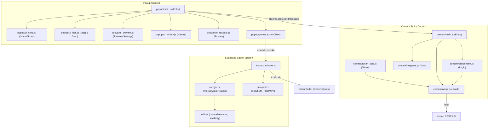

# Keden Extension Architecture

This document describes the modular architecture of the Keden PI Auto-fill extension.

## Overview

The extension is built using a modular approach to separate concerns between user interface (Popup), web-page interaction (Content Scripts), and external services (Supabase AI, Keden API).

AI extraction is handled by a Supabase Edge Function (`extract-ai`) — not the browser directly. The popup uploads documents to Supabase Storage, the function processes them with an LLM, merges results, runs cross-validation, and returns structured JSON.

## Directory Structure

```text
keden_extension/
├── manifest.json               # Extension configuration and script injection order
├── popup.html                  # UI structure of the extension popup
├── lib/                        # Third-party libraries (XLSX, PDF.js)
├── content/                    # Content scripts (running in the context of Keden pages)
│   ├── token_utils.js          # Shared token helper (getKedenToken) — must load first
│   ├── api.js                  # Keden-specific API client
│   ├── enrichment.js           # Data enrichment logic (taxpayer info by BIN/IIN)
│   ├── mappers.js              # Data transformation and payload construction
│   ├── keep_alive.js           # Service worker keep-alive
│   └── main.js                 # Entry point and message orchestration
└── popup/                      # Popup scripts (running in the extension UI)
    ├── file_readers.js         # Utilities for reading PDF and Excel
    ├── gemini.js               # Supabase API client (AI extraction calls)
    ├── ui_core.js              # Core UI helpers (status, toasts, stepper, timer)
    ├── ui_files.js             # File handling (drag-and-drop, file list rendering)
    ├── ui_preview.js           # Preview panel, validation summary, settings
    ├── ui_history.js           # History tab rendering
    └── main.js                 # Popup entry point and event handling
```

> **Script load order in popup.html:**
> `ui_core` → `ui_files` → `ui_preview` → `file_readers` → ... → `ui_history` → `main`
>
> **Content script load order in manifest.json:**
> `token_utils` → `api` → `keep_alive` → `mappers` → `enrichment` → `main`

## Component Architecture



## Module Responsibilities

### Content Scripts

- **token_utils.js**: Exposes `getKedenToken()` global — reads token from `localStorage`, strips stray quotes. Must be loaded before `api.js` and `keep_alive.js`.
- **api.js**: Handles all `fetch` requests to Keden's internal APIs. Uses `getKedenToken()` for authentication headers.
- **mappers.js**: Normalizes entity types and builds the complex JSON payloads required by the Keden API. Contains `COUNTRY_MAP` and entity type normalization logic.
- **enrichment.js**: Fetches additional details (full names, addresses) using BIN/IIN for resident entities.
- **keep_alive.js**: Keeps the service worker alive to prevent context invalidation.
- **main.js**: Listens for messages from the popup and orchestrates: Enrichment → Payload Building → API Submission.

### Popup Scripts

- **file_readers.js**: Converts raw file buffers into text/base64 using `pdf.js` for PDFs and `xlsx.js` for Excel.
- **gemini.js**: Uploads documents to Supabase Storage and calls the `extract-ai` Edge Function. Returns merged + validated JSON.
- **ui_core.js**: Core UI helpers — `setStatus`, `showToast`, `updateStepper`, `showError`, `resetApp`, timer functions.
- **ui_files.js**: File management — `handleFiles`, `renderFileList`, drag-and-drop initialization.
- **ui_preview.js**: Renders extraction results preview, validation summary, highlights fields, settings panel, `scrapePreviewData`.
- **ui_history.js**: Renders the history tab.
- **main.js**: Ties everything together — handles user events, starts the AI-filling sequence, sends data to content script.

### Supabase Edge Function (`extract-ai`)

- **index.ts**: Entry point. Handles file upload reception, routes to batch or streaming mode, calls LLM via OpenRouter.
- **prompts.ts**: Exports `SYSTEM_PROMPT` (static, sent as `role: "system"`) and `getBatchPrompt(filenames)` (dynamic).
- **merger.ts**: `mergeAgentResults(agentResults[])` — merges multi-document AI responses:
  - Deep merges `crossChecks` to avoid data loss across documents
  - Per-field best-source selection for `totalWeight`, `totalPackages`, `totalCost`
  - Majority vote on counteragent names with typo/conflict detection
  - 14 programmatic cross-checks (Σqty, Σweight, Σcost, invoice ref in CMR, date order, country consistency, etc.)
- **utils.ts**: `normalizeName` (strips legal forms like LTD/ТОО), `calculateSimilarity` (Levenshtein).

## Data Flow

1. **Input**: User drops documents into the popup.
2. **Upload**: `file_readers.js` parses files; `gemini.js` uploads them to Supabase Storage.
3. **AI Extraction**: `extract-ai` function sends files + prompt to LLM (Gemini/Qwen via OpenRouter).
4. **Merge & Validate**: `merger.ts` combines multi-document AI responses and runs 14 programmatic cross-checks.
5. **Preview**: Popup renders the merged result with validation warnings/errors via `ui_preview.js`.
6. **Communication**: `popup/main.js` sends approved data to `content/main.js` via `chrome.tabs.sendMessage`.
7. **Enrichment**: `content/enrichment.js` calls Keden APIs to fill in missing details for resident taxpayers.
8. **Execution**: `content/api.js` POSTs the final payload to Keden.

## Cross-Validation Checks (merger.ts)

| # | Check | Source |
|---|-------|--------|
| 1 | Σ cost товаров = invoiceTotal (AI self-report) | AI crossChecks |
| 2 | Вес совпадает по всем документам | AI crossChecks |
| 3 | Кол-во мест совпадает по всем документам | AI crossChecks |
| 4-5 | Имя получателя/отправителя — majority vote | AI crossChecks + mergedData |
| 6-7 | Номер тягача/прицепа совпадает с техпаспортом | AI crossChecks |
| 8 | Σ quantity = totalPackages | Программная |
| 9 | Σ grossWeight = totalWeight (допуск 1%) | Программная |
| 10 | Номер инвойса в CMR (гр.5) = document.number | Программная |
| 11 | Дата CMR ≥ дата инвойса | Программная |
| 12 | Страна отправителя = departureCountry | Программная |
| 13 | Страна получателя = destinationCountry | Программная |
| 14 | Σ cost товаров = totalCost (авторитетный источник) | Программная |

## Tests

| File | Runner | Count |
|------|--------|-------|
| `keden_extension/tests/mappers.test.js` | Node.js (`npm test`) | 19 |
| `extract-ai/tests/merger.test.ts` | Deno | 18 |
| `extract-ai/tests/omar_noman_case.test.ts` | Deno | 51 |

Run Deno tests:
```bash
cd keden_admin_supabase/supabase/functions/extract-ai
deno test tests/ --allow-read --allow-net
```
