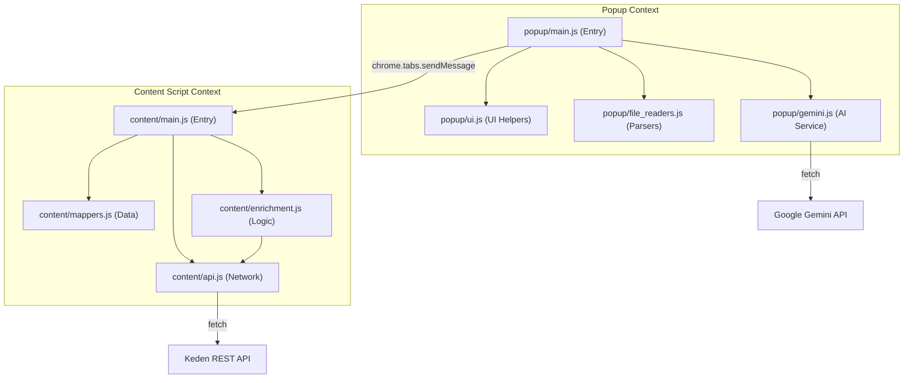

# Keden Extension Architecture

This document describes the modular architecture of the Keden PI Auto-fill extension.

## Overview

The extension is built using a modular approach to separate concerns between user interface (Popup), web-page interaction (Content Scripts), and external services (Gemini AI, Keden API).

## Directory Structure

```text
keden_extension/
├── manifest.json           # Extension configuration and script injection order
├── popup.html              # UI structure of the extension popup
├── lib/                    # Third-party libraries (XLSX, PDF.js)
├── content/                # Content scripts (running in the context of Keden pages)
│   ├── api.js              # Keden-specific API client
│   ├── enrichment.js       # Data enrichment logic (taxpayer info)
│   ├── mappers.js          # Data transformation and payload construction
│   └── main.js             # Entry point and message orchestration
└── popup/                  # Popup scripts (running in the extension UI)
    ├── file_readers.js     # Utilities for reading PDF and Excel
    ├── gemini.js           # Gemini API client and prompts
    ├── ui.js               # UI helpers (status, loading, drag-and-drop)
    └── main.js             # Popup entry point and event handling
```

## Component Architecture



## Module Responsibilities

### Content Scripts

- **api.js**: Handles all `fetch` requests to Keden's internal APIs. Manages authentication headers retrieved from `localStorage`.
- **mappers.js**: Contains logic to normalize entity types and build the complex JSON payloads required by the Keden API. Includes static mappings like `COUNTRY_MAP`.
- **enrichment.js**: Fetches additional details (like full names and addresses) using BIN/IIN for entities identified by Gemini.
- **main.js**: Listens for messages from the popup and orchestrates the filling process: Enrichment -> Payload Building -> API Submission.

### Popup Scripts

- **file_readers.js**: Converts raw file buffers into text chunks using `pdf.js` for PDFs and `xlsx.js` for Excel files.
- **gemini.js**: Sends document text to the Gemini API with a specialized prompt to extract structured JSON data.
- **ui.js**: Manages the visual state of the popup (loading spinners, status messages, file list).
- **main.js**: Ties everything together. Handles user clicks, file selection, and starts the AI-filling sequence.

## Data Flow

1. **Input**: User drops documents into the popup.
2. **Processing**: `file_readers.js` extracts text; `gemini.js` extracts structured data.
3. **Communication**: `popup/main.js` sends the extracted data to `content/main.js` via `chrome.tabs.sendMessage`.
4. **Enrichment**: `content/enrichment.js` calls Keden APIs to fill in missing details for resident taxpayers.
5. **Execution**: `content/api.js` POSTs the final data to Keden, and the page is reloaded to show results.
